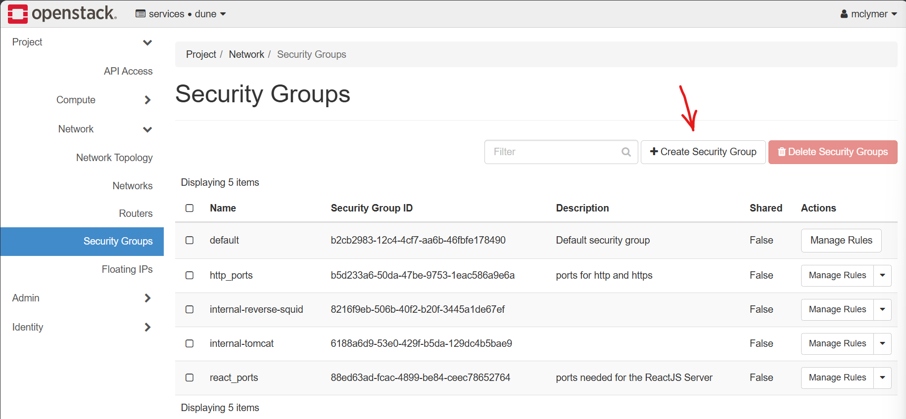
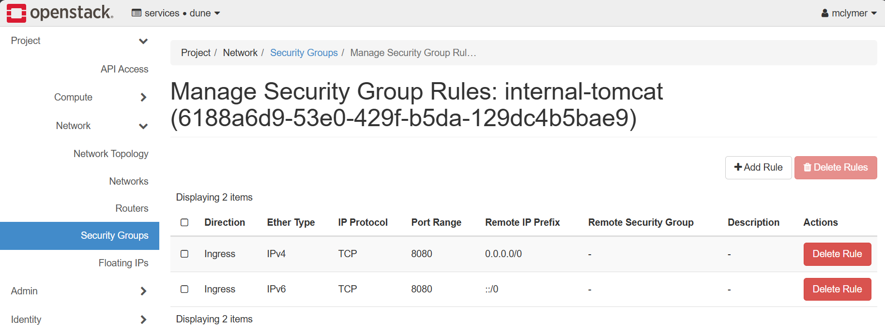
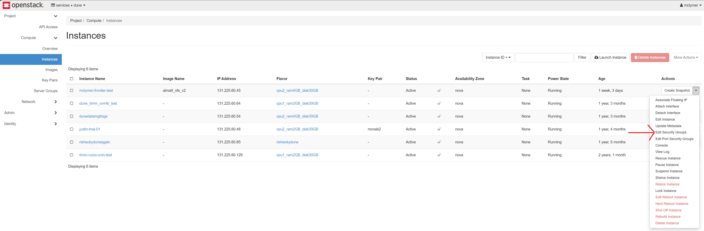
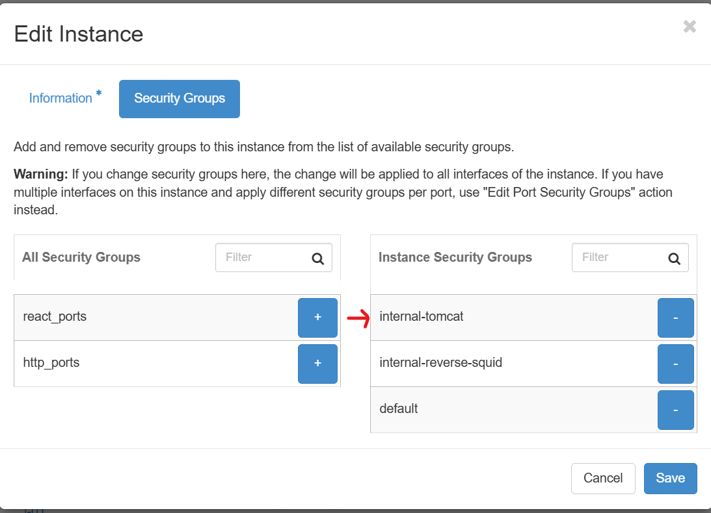

# frontier-condb2-test
This repository contains the code and documentation related to the installation, configuration, and testing of a Frontier (server, client, cache) connection to a ConDB2 API server backend.

## FermiCloud Instance Setup

### Getting FermiCloud Access

- Submit a ticket for [Access to FermiCloud](https://fermi.servicenowservices.com/wp?id=evg_sc_cat_item&sys_id=35d4f481f98c7800a72dc20d261a4e7f)
- [FermiCloud OpenStack Docs](https://fifewiki.fnal.gov/wiki/FermiCloud_Openstack)

### Connecting to the FermiCloud OpenStack Dashboard

- You will need to either be on the local FNAL network or use a remote VPN (`vpn.fnal.gov`) connection.
  - Follow the [instructions](https://fermi.servicenowservices.com/wp?id=evg-kb-article&sys_id=567a699a1b73f0104726a8efe54bcbe3) appropriate to the system you are working on.
  - This requires installing Fermilab CA certificates.
  - The remote VPN connection requires that use the RSA Authenticator app to get a token. This requires creating a ticket to create a PIN to authenticate.
  - You will also need to use your FNAL Services credentials to connect to the VPN.
- [FermiCloud OpenStack Dashboard](https://fcl2104.fnal.gov/dashboard)
  - Dashboard authentication requires your FNAL Services credentials.

### Creating a New FermiCloud Instance

- **Note: FermiCloud instances are meant only for development and testing purposes. Production workloads are not supported.**
- Follow the [How to Start a New FermiCloud Instance](https://fifewiki.fnal.gov/wiki/How_to_Start_a_New_FermiCloud_Instance).
- For the **"Source"** image choose the most recently updated AlmaLinux 9 version with NFS.
- In **"Flavor"** select the 2 VCPU / 4GB RAM / 30GB option. *Note: This configuration mirrors Dave Dykstra's Frontier FermiCloud instance.*
- Select `ipv4` for the **"Network"** option. This makes instance access and network configuration easier.

### Accessing the Newly Created Instance

- The `mclymer-frontier-test` instance URL: `fermicloud725.fnal.gov`
- Make sure that you have [Kerberos configured](https://dune.github.io/computing-basics/setup) for SSH access to your instance.
  - Follow the instructions to generate a Kerberos ticket.
  - If remote, you will need to be connected to the VPN to `ssh` into you FermiCloud instance.
- To update system libraries and install software you will need root access permissions.
  - `sudo` does not work on FermiCloud VMs.
  - SSH into the VM directly for root access: `ssh -l root fermicloud725.fnal.gov`
  - There was an issue with being added to the correct group for root access. Needed `/root/.k5login` modified to give me access.

## Frontier "Launchpad" Server Setup on FermiCloud Test Instance

### Relevant Documentation
- [Frontier Distributed Database Caching System Overview](https://twiki.cern.ch/twiki/bin/view/Frontier/FrontierOverview)
- [Installing frontier-tomcat](https://twiki.cern.ch/twiki/bin/view/Frontier/FrontierOverview)

### Installation

- Follow the above linked installation document.
- Do not make any of the changes detailed in the "Preparation" section.
- Follow all of the steps in the "Installation" section, but substitute the `dnf` command in for `yum`.
- Before you run `[root@fermicloud725 ~]# systemctl enable frontier-tomcat` do the following:
  - As root user, you need to install `initscripts` and `chkconfig`.
    ```
    [root@fermicloud725 ~]# dnf install initscripts chkconfig
    ```

### Configuration

- Add the following configuration to `/etc/tomcat/servlets.conf`
  ```
  [dune_runcon_prod]
  LongCacheExpireSeconds: 300
  ShortCacheExpireSeconds: 300
  MaxDbAcquireSeconds: 300
  MaxThreads: 5
  FileBaseDirectory: https://dbdata0vm.fnal.gov:9443/dune_runcon_prod/
  ```
- Before you run `[root@fermicloud725 ~]# systemctl start frontier-tomcat`:
  - You will need to run - `ln -s /etc/rc.d/init.d /etc/init.d` to make sure that it can find the correct startup script.
  - The `frontier-tomcat` installation creates the `tomcat` user and group, but not the associated `/home` directory.
  - Create the required directory:
    ```
    [root@fermicloud725 ~]# mkdir /home/tomcat
    [root@fermicloud725 ~]# chown -R tomcat:tomcat /home/tomcat
    ```

- A network security group needs to be created to allow IPv4 and IPv6 ingress access to port 8080.
  - This allows for requests to be handled by the `frontier-tomcat` servlet.
  - In the OpenStack dashboard go to `Network > Security Groups`.
    - Click the "Create Security Group" button.
    
    - Give the group a name and optional description. We used `internal-tomcat`.
    - Once the security group has been created, delete the "Egress" rules.
    - Then add two "Ingress" rules; one for IPv4 and one for IPv6.
    
  - This security group now needs to be added to your FermiCloud instance.
    - Find your instance on the "Instances" view.
    - Select "Edit Security Groups" from the "Actions" dropdown menu.
    
    - Add the security group to the list of "Instance Security Groups and save it.
    

### Connection Testing

- Test the connection between your `frontier-tomcat` setup and the ConDB2 API backend.
  - **Note: You will need to be on the FNAL network to run the test. See the above VPN connection details.**
  - The server should be listening on port 8080 at the domain name created for your FermiCloud instance.
  - In a terminal on a separate system, run a query to the ConDB2 API, proxied by the connected Frontier server.
  ```
  $ curl -H "Accept: application/xml" -H "X-Frontier-Id: test" "http://fermicloud725.fnal.gov:8080/dune_runcon_prod/Frontier/type=frontier_file:1:DEFAULT&encoding=BLOB&p1=get%253ffolder%253dpdunesp.test%2526t%253d23300"
  <?xml version="1.0" encoding="US-ASCII"?>
  <!DOCTYPE frontier SYSTEM "http://frontier.fnal.gov/frontier.dtd">
  <frontier version="3.42" xmlversion="1.0">
   <transaction payloads="1">
    <payload type="frontier_file" version="1" encoding="BLOB">
     <data>BgAAAM9jaGFubmVsLHR2LHRyLGRhdGFfdHlwZSx1cGxvYWRfdGltZSxzdGFydF90aW1lLHN0b3Bf
  dGltZSxydW5fdHlwZSxzb2Z0d2FyZV92ZXJzaW9uLGJ1ZmZlcixhY19jb3VwbGUKMCwyMzMwMC4w
  LDE3MDAwNjc0MDYuOTcyODkwMSxucDAyX2NvbGRib3gsMTcwMDA2NzQwNi45NzI4NjQ2LDE3MDAw
  Njc4MDMuMCxOb25lLFRFU1QsZmQtdjQuMi4wLWM2LE5vbmUsTm9uZQoH</data>
     <quality error="0" md5="3437dff6878ab524247531f6742ee8f9" records="1" full_size="213"/>
    </payload>
   </transaction>
  </frontier>
  ```

